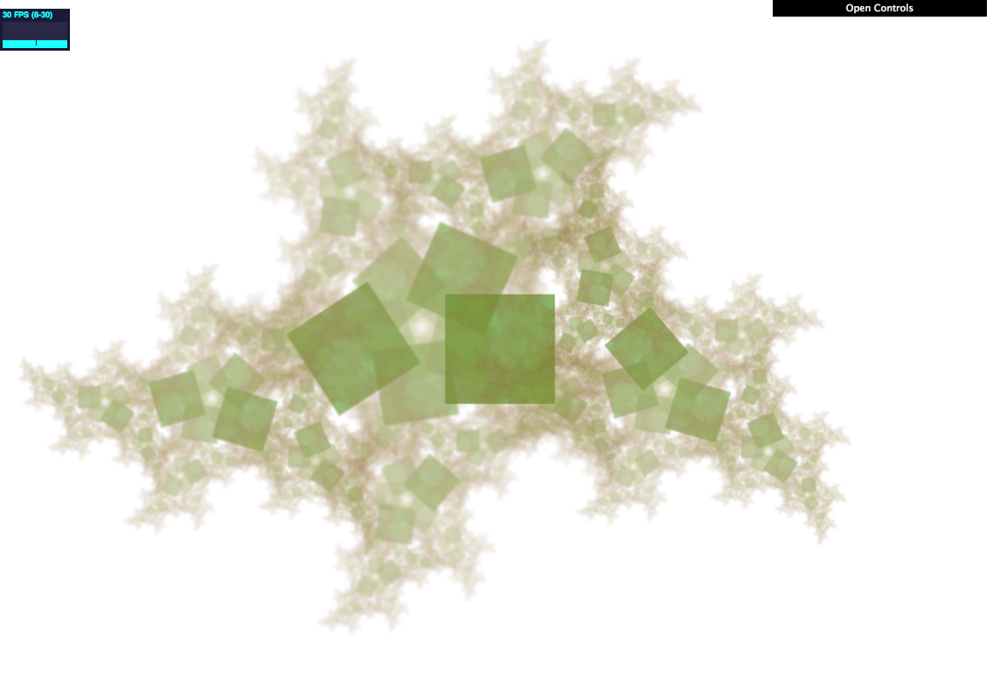
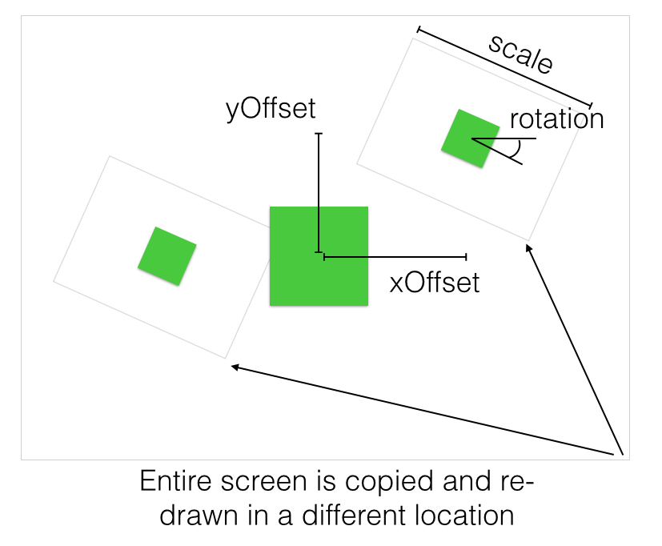

# Fractal Feedback

Uses Three.js/WebGL to recursively grab the screen and render it back slightly transformed. This is similar to video feedback techniques for creating fractals.

# Source

src/feedback.html - stand-alone test environment

threejs-src - redundant source code for three.js (three.min.js is the minimized version actually used).

## Usage

open src/feedback.html in a WebGL capable browser

## Example

## How it works

Process
  1. copy the whole screen to an offscreen canvas
  2. draw the center seed shape (simple circle or square)
  3. draw the offscreen canvas rotated and scaled, once for transform 1 and once for transform 2
  4. repeat process

The controls just modify how the mouse position changes the transform.
